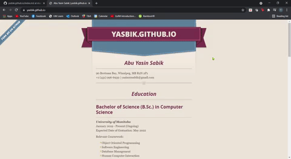

# Hosting a Resume on GitHub Pages

## **Purpose**
This readme is a description of how to format a resume with Markdown and host it on GitHub using Jekyll and GitHub Pages. All of this also relates to the general principles of current Technical Writing, as explained in Andrew Etter's book [Modern Technical Writing](https://www.amazon.ca/Modern-Technical-Writing-Introduction-Documentation-ebook/dp/B01A2QL9SS).

## **Prerequisites**

- A Markdown editor.
    - A list of popular markdown editors is presented in Additional Resources.
- A resume, formatten in Markdown.
    - A Markdown tutorial is included under Additional Resources.
    - A sample markdown formatted resume is available [here](https://github.com/yasbik/yasbik.github.io/blob/main/index.md).
- A [GitHub](https://github.com/) account.
    - A tutorial on getting started with GitHub is included under Additional Resources.

## **Instructions**

## 1. Choosing a Lightweight Markup Language and an Editor

The first step is to create the actual resume and format it using a Lightweight Markup Language.
In his book, Modern Technical Writing, Andrew Etter recommends using Markdown to do this. This is beacause, compared to other markup languages, Markdown is very simple, human-readable, and easy to learn. Additionally, since Markdown files are plain text, they can be eidted by any editor. Because of all of this, Markdown is the most widely used lightweight markup language in the world, which Etter states in his book.

We will also be using Markdown for the purpose of this task. To start, we will first need to pick a Markdown editor. I have personally chosen [VS Code](https://code.visualstudio.com/) to write this document. A list of popular markdown editors is presented in Additional Resources. 

Although there are many specialized text editors for markdown, Etter suggests the following three, based on the operating system:

- [MarkdownPad](http://www.markdownpad.com/) (Windows)
- [iAWriter](https://ia.net/writer) (macOS)
- [ReText](https://sourceforge.net/directory/development/wordprocessors/os:windows/) (Linux)

## 2. Formatting the Resume in Markdown

Next, use the editor to format your resume in Markdown. If you need help woth this, a Markdown tutorial is included under Additional Resources. 

One thing to note is that Markdown is available in several variants/flavours and for the purpose of this task, we will use a [GitHub Flavoured Markdown](https://github.github.com/gfm/) 
to ensure that is gets properly rendered in Github Pages. 

Lastly, ensure that your resume is named as `index.md`.

## 3. Using a Distrubuted Version Control System

The next step is to upload the markdown formatted resume to a distributed version control system (DVCS) such as Git or Mercurial. Etter highly emphasizes using DVCS over centralized systems because they have better performance, allow for offline work, and are superior for concurrent work on the same file. Etter quotes, "For technical writers, the most important reason to use DVCS is that develops prefer them."

For the purpose of this task, we will be using [GitHub](https://github.com/). It is an open-source software and its version control system allows multiple people to collaborate on projects seamlessly without hampering the integrity of the original project.

## 4. Setting up a GitHub Repository and Uploading the Resume

In order to upload the resume to GitHub, we first need to create a new repository and then push our resume to it. The steps to do this are outlined below:

- Create a repository
    1. Log in to your GitHub account. 
    2. On the [homepage](https://github.com/), click the green `New` button  on the `Repositories` section.
    3. Name your repository `<YourUsername>.github.io` where `<YourUsername>` is your GitHub `username`. 
    4. Ensure that the repository is `public` and click the `Create Repository` button to create the repository.  

- Add your resume to the repository
    1. Once the new repository has been created, on the `Quick Setup` panel, click on the `uploading an existing file` button.
    2. If your repository already contains files, click the `Add file` button and choose `Upload files`.
    3. Select your markdown formatted resume file, named `index.md` and click the green `Commit changes` button. Your file should now have been added to your repository.

The resume should now be successfully uploaded to the online repository. Adding the resume file to the repository can also be done using the command line. Steps to do this can be found [here](https://guides.github.com/activities/hello-world/).

## 5. Generating a Static Website

The final step to this task is to use a static website to host the resume that we created. In his book, Etter deeply encourages making static websites due to their speed, simplicity, portability, and security. Additionally, Etter mentions that they have no server-side application dependencies, no databases, and nothing to install and are therefore always an excellent option to consider. 

For the purpose of this task, we will be hosting our resume using [GitHub Pages](https://pages.github.com/) and [Jekyll](https://jekyllrb.com/) to host our resume. These tools are free to use and generate a static website from our Markdown file very efficiently.

## 6. Hosting the Resume on Github Pages

The steps to host the resume with a theme on GitHub pages using Jekyll are given below:

1. Go to the repository and click on `Settings`.
2. Navigate to the `Pages` section to go to the GitHub Pages webpage. 
3. Make sure that the `main branch` is selected under the `Source` section.
4. Click on the `Choose Theme` button to be redirected to a page showing the available themes for the static website.
5. Pick a theme and click on `Select Theme` to use it. This will bring you back to the settings window.
6. Click on `Commit Changes` to finalize everything and create the static website.

We will now be able to see the resume on out static website. To do this, we can open a browser tab/window and type in `<YourUsername>.github.io`. This should display your resume on our static website.

The final product of all of this should look like this:

## **Additional Resources**

1. [List of Markdown Editors](https://www.oberlo.com/blog/markdown-editors)
2. [A tutorial for Markdown](https://www.markdowntutorial.com/)
2. [Modern Technical Writing](https://www.amazon.ca/Modern-Technical-Writing-Introduction-Documentation-ebook/dp/B01A2QL9SS) by Andrew Etter
3. [Getting Started with Git and GitHub](https://product.hubspot.com/blog/git-and-github-tutorial-for-beginners)

## **Authors and Acknowledgements**

This document was written by Abu Yasin Sabik using Andrew Etter's book *Modern Technical Writing* as reference. 

Thank you Stewart Wilcox for teaching the course Technical Communication in Computer Science.
Thank you to Abdullah Al Noman, Jaden Down, Long Vu, and Muhammad Hasan Saleem for peer editing.

## **FAQs**

### **Why is Markdown better than a word processor?**

Markdown is better than a word processor because it secure and provides more readable and structured output. Since Markdown files are plain text, people can understand and even learn it very easily. The benefit it provides over a word processor is that due to Markdown's structure and syntax, it can easily be rendered and processed by computers and other programs.

### **Why is my resume not showing up?**

Sometimes, Github pages may take 15-20 minutes to be displayed. So if the resume does not show up right away, check back in after a few minutes. This delay also applies to when themes are changed for the page.

Additionally, you may want to ensure that all the following are true:

- The repository is named `<YourUsername>.github.io` where `<YourUsername>` is your `GitHub username`.
- The Markdown formatted resume is named `index.md`.
- Your page is `published` in the `GitHub Pages` menu under `settings`.

---

